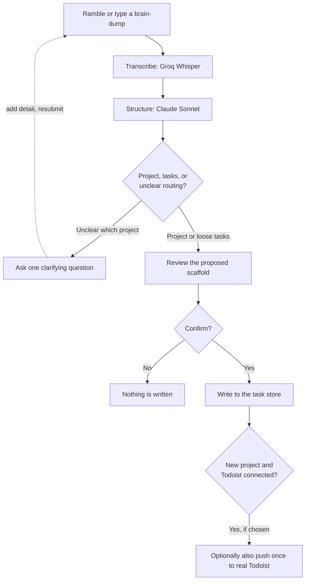
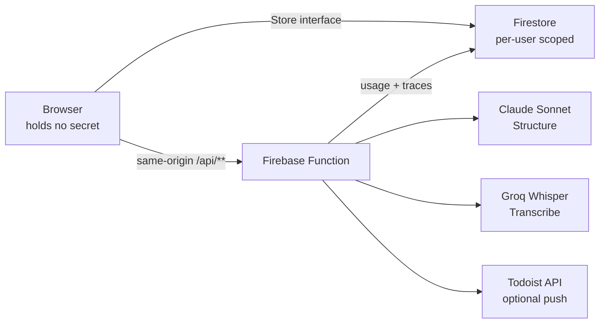
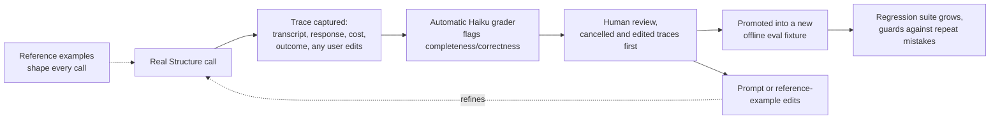

# Super Ramble

**Live at [super-ramble.web.app](https://super-ramble.web.app).** Sign in
and ramble a real brain-dump. Connecting a real Todoist account is optional,
and only needed for the one-shot push described below.

Todoist's own Ramble already solves fast capture well: speak a brain-dump,
get separate tasks back in seconds. It is flat by design though. Its own
interface states it does not create sub-tasks, and a brain-dump is often not
a list of loose items. It is a project waiting to be structured: a goal, a
set of steps, some of them nested. Super Ramble is the step right after
Ramble, for that one case: it reads a brain-dump, decides whether it is loose
tasks or a coherent project, and when it is a project, proposes a scaffold
with sections, tasks, and nested sub-tasks. When you want it there, Super
Ramble writes the confirmed result straight into your real Todoist account:
a second, independent write alongside its own task store, not a sync. This
is a companion to Ramble, for the one thing it does not do, not a competitor
to it.

## See it work



Nothing left of "Confirm" ever runs before the click. A cancelled or
unconfirmed proposal writes nothing, anywhere.

## Architecture, in short



The browser talks to a single store interface (`src/store/`), never to the
Firestore SDK's write path directly for anything the interface covers: one
Firestore adapter for a signed-in user, one localStorage adapter for local
preview, both implementing the same methods so the app and the offline
evals see one shape. Every write of a project (with its sections and nested
tasks) goes through one batched call, `store.createProjectTree`.

The browser holds no secret. Anything that needs one, transcription,
structuring, or a Todoist call, goes through a same-origin Firebase Function
that verifies the Firebase Auth token, reads the Anthropic, Groq, and
Todoist keys from Function secrets, enforces a per-user daily request and
cost limit, and logs privacy-safe usage. See
[docs/architecture.md](docs/architecture.md) for the full data model, the
store interface, and the Todoist client contract.

## How the pipeline works

Three stages, detailed in [docs/llm-pipeline.md](docs/llm-pipeline.md).
Classify and Structure are one combined call, not two.

1. **Transcribe.** Audio in, transcript out, via Groq's hosted Whisper Large
   v3 Turbo, through `POST /api/transcribe`. Recorded then transcribed, not
   live-streamed. Typed text is a pass-through with no call at all. A hard
   cap of 300 seconds and 10MB on the decoded payload, rejected before any
   Groq call.
2. **Structure.** One call decides whether the dump is loose tasks or a
   coherent project, with a visible `reasoning`, and, when it is a project,
   emits the tree: sections, tasks with inline nested sub-tasks, priorities,
   and natural-language due strings. A separate `needsClarification` axis is
   reserved for routing uncertainty only (does this belong to an existing
   project, or is it new), never for uncertainty about whether the content
   is project-shaped. Runs on Claude Sonnet, temperature 0, a deliberate,
   named exception to every other call's Haiku default, because structuring
   quality is the whole product.
3. **Write.** Runs only on explicit user confirm. A pure function, no model
   call: translates the validated Structure response into
   `store.createProjectTree`, flattening nested sub-tasks into sibling
   references. If Todoist is connected and the response is a confident new
   project, an explicit, off-by-default toggle can also push the same tree
   once into the user's real Todoist account. The local write always runs
   first, and a Todoist-side failure never rolls it back.

### Does this get smarter over time?

Precisely, and without overclaiming: **the model itself is never retrained.
This is not fine-tuning.** What actually improves is a human-supervised loop
where real failures become permanent regression tests, inform edits to the
prompt (`src/pipeline/prompt.js`) a person writes by hand, and occasionally
become a new worked example added to that same prompt.

Every real Structure call already sees more than written rules.
`src/pipeline/referenceExamples.js` holds four hand-picked
`{ transcript, response }` pairs, injected directly into the live system
prompt on every real call: one clean project with nested sub-tasks, one
real multi-section trip, one case that stays loose tasks on purpose (a
restraint example, not just "always make a project"), one case where
sections earn their keep. This is separate from `evals/fixtures/*.json`,
which the offline suite reads with a mocked model and never reaches the
real API; the reference examples are the one teaching mechanism that
actually runs on every real call. A person edits this file by hand, the
same way a person edits the prompt itself; the model never writes to it.
`functions/referenceExamples.js` is a hand-synced copy for the same reason
the prompt itself needs one, and `check:prompt-sync` (above) is what
catches the two copies drifting.



Every real Structure call persists a full trace to
`users/{uid}/structureTraces`: transcript, response, cost, and how the user
actually responded to the proposal. That response is not only a plain
confirm or a cancel. If the user removes a task, edits its content, or
renames the project in the preview before confirming, that correction is
captured too (`removedTasks`, `contentEdits`, `projectNameChange`), a
fourth outcome, `confirmed_with_edits`, alongside plain `confirmed` and
`cancelled`. A user's own correction becomes a real, structured signal into
the same review loop, not something thrown away once the click lands.

Before any of that reaches a person, `npm run traces:grade`
(`scripts/grade-traces.mjs`) runs an automatic first pass: one cheap call
per ungraded trace on this app's default Haiku model, hard-locked away
from the real Structure call's Sonnet by design, so the grader can never be
confused with, or billed against, the thing it grades. It flags, never
fixes, two things: whether the response seems to be missing anything the
transcript mentioned, and whether priorities or due dates look defensible
given the transcript's own wording. It is not infallible, and its own
verdicts get spot-checked against a real manual read on the same review
cadence below, not trusted blindly. It has already proven itself once: a
real run against every ungraded trace on 2026-07-13 correctly re-caught the
same priority-inversion bug described below, in the original Big Sur trace,
on its own, with no person pointing it there first
(`docs/resolution-log.md`, commit `121934a`).

Traces, now graded, are reviewed on a stated cadence, at least monthly or
after every 10 new traces, whichever comes first; cancelled and
confirmed-with-edits traces are reviewed first, tied for highest signal,
since either means the model got something wrong that mattered, not just a
detail nobody minded. A reviewed trace can be promoted into a new offline
eval fixture (`scripts/promote-trace.mjs`), so the regression suite grows
from real usage instead of staying a fixed, hand-written set. See
[docs/llm-pipeline.md](docs/llm-pipeline.md)'s "Live capture and the eval
flywheel" section for the full review cadence, and
[docs/pipeline-learnings.md](docs/pipeline-learnings.md) for the running,
dated log of what that review has actually found and fixed.

Two real caught bugs are the evidence this loop actually works, not just a
description of how it is supposed to:

- **Priority direction shipped inverted once, in the Structure prompt
  itself.** The 2026-07-08 resolution log entry, "Priority direction
  calibration blind spot," found a confirmed trace where "Dig out sleeping
  bags from garage" (the speaker's own words: "not urgent") came back
  priority 1, and "Book campsite reservation" ("urgent," "fills up fast")
  came back priority 4, exactly backward. The root cause was three layers
  deep: the prompt never stated which direction priority ran, a validator
  comment stated the direction backward, and no existing fixture asserted a
  priority value against the transcript's own stated urgency at all, so the
  capture-and-promote loop would have baked the inverted result in as a
  trusted fixture forever. The fix added an explicit direction line to the
  prompt, corrected the comment, and added `priorities`/`due` assertions to
  the fixture format. `docs/architecture.md` separately documents the same
  class of bug in the local-to-Todoist priority mapping
  (`toTodoistPriority`, `5 - localPriority`), now guarded by
  `scripts/eval-todoist.mjs`'s deterministic assertion, no live call needed.
- **"Confirmed" does not mean "correct."** The 2026-07-08 entry, "First real
  review of the Structure trace collection," reviewed the very first
  confirmed trace ever manually checked, field by field, instead of trusting
  the user's Confirm click. It was the same camping trip trace above: the
  user had already confirmed it, and it still had the inverted priority bug.
  That finding is the reason the review step exists and is never skipped,
  stated in the entry itself: "a person already looked at that exact tree
  and accepted it" is true for promotion purposes, but a Confirm click means
  the structure looked right at a glance, not that every field was checked.

The guardrails around this, briefly: the Structure response is constrained
to a JSON Schema server-side through structured outputs, a validator then
checks what a schema cannot (grounding against invented content, cross-field
coherence like a sub-task's `sectionRef` actually resolving), one corrective
retry on failure, then a fail-closed response rather than a guessed
structure. Nothing ever writes without the user's own explicit confirm.

## Documentation

`docs/` is the single source of truth; root tool files (`CLAUDE.md`,
`AGENTS.md`, `.cursorrules`) only point there.

- [docs/orchestration.md](docs/orchestration.md), the loop every agent
  (human or AI) runs before building: read the docs, challenge conflicts,
  build to them, verify, update them, and log the resolution.
- [docs/brief.md](docs/brief.md), the problem, the product, the user, and
  the constraints this app is built against.
- [docs/architecture.md](docs/architecture.md), the data model, the store
  interface, the Todoist client contract, and the `/api` Function contract.
- [docs/design-system.md](docs/design-system.md), the visual source of
  truth: tokens, per-view conventions, the responsive rules, and the
  anti-pattern checklist every view is checked against.
- [docs/llm-pipeline.md](docs/llm-pipeline.md), the pipeline contract in
  full: the exact Structure request/response shape, eval assertions per
  stage, cost posture, and the live-trace review cadence.
- [docs/pipeline-learnings.md](docs/pipeline-learnings.md), short, dated
  entries logging real findings from real traces (what was wrong, what
  changed), distinct from the resolution log's everything-log.
- [docs/roadmap.md](docs/roadmap.md), what's built, phase by phase, what's
  next, and what's deliberately out of scope.
- [docs/resolution-log.md](docs/resolution-log.md), the append-only, dated
  history of what was done and the decisions a future pass should not
  relitigate.

<details>
<summary>For developers</summary>

### Run locally

```bash
npm install
cp .env.example .env.local   # fill in the Firebase web config values
npm run dev                  # serves on http://localhost:5173
```

Set `VITE_ENABLE_LOCAL_PREVIEW=true` in `.env.local` to see the app without
real Firebase Auth, signed in as a local preview user against a localStorage
store.

### Run the evals (the default no-credit check)

```bash
npm run eval                 # eval:offline + eval:date + eval:todoist + eval:write + check:prompt-sync
```

Offline evals run the real structuring pipeline against synthetic fixtures
using mocked model responses. They never call the model and spend no
credits. They assert the JSON contract end to end and write
`evals/runs/latest.json`. `eval:date` and `eval:todoist` are deterministic,
model-free checks (day-boundary logic, the Todoist priority-inversion and
due-string mapping) with no fixtures of their own. `eval:write` proves the
Super Ramble preview's per-task removal, content edits, and project rename
survive into `store.createProjectTree`'s output correctly, also with no
model call. `check:prompt-sync` diffs `src/pipeline/prompt.js` and
`src/pipeline/referenceExamples.js` against their hand-synced copies in
`functions/`, which Firebase Functions cannot import directly, and fails
loudly on drift.

Live evals are gated and bounded, and need the dev server running:

```bash
EVAL_ALLOW_LIVE=true npm run eval:live
EVAL_ALLOW_LIVE=true EVAL_MAX_CASES=2 npm run eval:live
EVAL_ALLOW_LIVE=true EVAL_CASE_IDS=01-clear-single-project npm run eval:live
```

### Watch spend

```bash
npm run trace:summary
```

Every local live call writes a raw trace under `llm-traces/` (gitignored).
The summary reports total cost, per-step token and cost breakdown, failures,
and a budget block against `LLM_SPEND_CEILING_USD` (default 50). Empty is
fine before your first live call. This only ever reads local traces, not
production usage; production trace review goes through `npm run
traces:list` and `npm run traces:promote` instead, see
[docs/llm-pipeline.md](docs/llm-pipeline.md).

### Privacy

Personal free text (transcripts, task contents, project names) is meant to
be encrypted client-side with AES-GCM before any Firestore write. The
AES-GCM encrypt/decrypt seam exists at `src/lib/crypto.js`, but it is not
yet wired into `store/`. Today the store writes task and project text as
plaintext to Firestore. Wiring encryption into the write path, plus deciding
per-user key derivation and storage, is open work before that privacy claim
is true end to end.

Production stores only privacy-safe usage per user per day at
`users/{uid}/llmUsage/{YYYY-MM-DD}`. Raw prompts and responses are off by
default (`LLM_STORE_RAW_TRACES=false`) and are a local debugging tool only.
Firestore rules scope every document to its owner.

### Deploy

Requires the Firebase project secrets and your `.env.local`. Do not deploy
without them.

```bash
firebase functions:secrets:set ANTHROPIC_API_KEY
firebase functions:secrets:set TODOIST_CLIENT_SECRET
firebase functions:secrets:set GROQ_API_KEY
npm run build
firebase deploy
```

Hosting serves `dist/`, rewrites `/api/**` to the `api` Function, and
SPA-rewrites the rest. The app publishes to https://super-ramble.web.app.
`npm run verify:prod-env` must pass before any deploy that includes a
hosting rebuild; it checks `.env.local` for a local-preview flag that must
never ship to production.

### CI

On every push and pull request, `.github/workflows/ci.yml` runs `npm ci`,
`npm run build`, `npm run eval` (offline, date, Todoist, write, and the
prompt sync check, no credits spent), and a syntax check on the Function.
Green before anything else.

</details>
